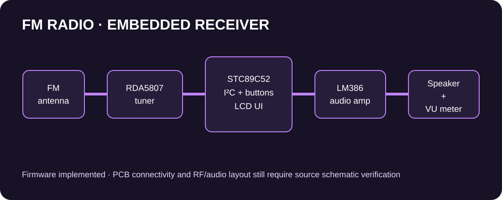

# FM Radio



A fully functional FM radio receiver built from the ground up: a PCB-based embedded system that receives, processes, and converts RF signals into real-time audio with interactive tuning and display.

**Hardware:** STC89C52RC (8051) · RDA5807 FM receiver · LCD1602 · LM386 audio amp · KA2284 LED VU meter
**Firmware:** C51 — bit-banged I2C, RDA5807 driver, LCD UI, debounced buttons

## System overview

| Subsystem | Part | Role |
|---|---|---|
| RF reception | RDA5807 | Tuning, filtering, demodulation across 87–108 MHz |
| Embedded control | STC89C52RC | I2C to RDA5807, buttons, LCD1602 — the hub |
| Audio | LM386 | Amplifies demodulated audio to the speaker (analog, no MCU pins) |
| Visual feedback | KA2284 | VU-style LED meter driven by the audio signal (analog, no MCU pins) |

## Pin map (STC89C52RC)

Single source of truth: `firmware/pinmap.h`. **Verify against your schematic** — change it there once and the whole firmware follows.

| Function | Pin | Notes |
|---|---|---|
| I2C SDA → RDA5807 | P1.0 | Bit-banged, needs 4.7 kΩ pull-up |
| I2C SCL → RDA5807 | P1.1 | Bit-banged, needs 4.7 kΩ pull-up |
| LCD RS | P2.4 | LCD1602, 4-bit mode |
| LCD EN | P2.5 | |
| LCD D4–D7 | P2.0–P2.3 | |
| TUNE+ / TUNE− | P3.2 / P3.3 | Active-low tactile, hold to auto-repeat |
| SEEK | P3.4 | Active-low, seeks up to next station |
| VOL+ / VOL− | P3.5 / P3.6 | Active-low, RDA5807 digital volume 0–15 |
| MUTE | P3.7 | Active-low toggle |

## Firmware layout

```
firmware/
├── pinmap.h      # ALL pin assignments — edit to match your schematic
├── system.h/.c   # Timer0 1 ms tick, delay_ms (assumes 11.0592 MHz crystal)
├── i2c.h/.c      # Bit-banged I2C master (~100 kHz)
├── rda5807.h/.c  # RDA5807 driver: init, tune, seek, volume, mute, stereo detect
├── lcd1602.h/.c  # HD44780 4-bit driver
├── buttons.h/.c  # Debounced buttons + hold-to-repeat on TUNE keys
└── main.c        # App: splash, status display, input loop
```

The subsystem diagram and electrical checklist are in
[`hardware/README.md`](hardware/README.md). They document design intent; the
actual PCB still requires verification against the source schematic.

## Building & flashing

**Keil µVision 5 (recommended for STC89C52):**
1. New µVision project → device `STC89C52RC`, add all `firmware/*.c`.
2. Build (target: HEX file). 8 KB flash is plenty — the binary is ~4 KB.

**SDCC (free):** mostly compatible, but `sbit`/`interrupt` syntax is Keil-style — expect small porting edits.

**Flash:** STC-ISP over UART (P3.0/P3.1), standard STC cold-boot procedure.

## I2C notes

The 8051 has no hardware I2C, so it's bit-banged on P1.0/P1.1 at ~100 kHz. The STC89C52's quasi-bidirectional ports have only weak internal pull-ups — **external 4.7 kΩ pull-ups to VCC on SDA/SCL are required**. RDA5807 7-bit address is `0x10`.

## Display

- Line 0: `FM  99.9 MHz ST` — frequency + stereo indicator (from the RDA5807 status register)
- Line 1: `Vol 8` / `MUTE` / `Seeking...`

## Status

- [x] Pin map defined (`pinmap.h`)
- [x] Bit-banged I2C, RDA5807 driver, LCD1602 driver, button handling, main app
- [ ] Verify pin map against the actual schematic/PCB
- [ ] Confirm crystal is 11.0592 MHz (else retune `system.c` timing)
- [ ] Add KiCad schematic + PCB under `hardware/`
- [ ] Add board photos / demo under `docs/`

## License

MIT — see [LICENSE](LICENSE).
