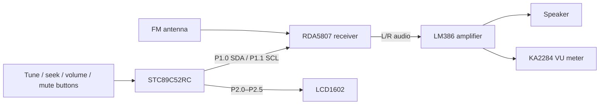

# Hardware integration

## Electrical checklist

- Fit external 4.7 kΩ pull-ups on SDA and SCL to the RDA5807 logic rail.
- Confirm every connection against `firmware/pinmap.h` before fabrication.
- Decouple each IC locally and separate RF/audio return paths from noisy
  digital and speaker-current paths.
- Verify the RDA5807 module's logic and supply voltage; do not assume a bare IC
  and a breakout module have identical power requirements.
- Confirm an 11.0592 MHz MCU crystal or update the timer and I2C timing code.

Place the source KiCad project, schematic PDF, Gerbers, and BOM in this folder
when the verified board design is available. Firmware pin assignments should
remain traceable to schematic net labels.
